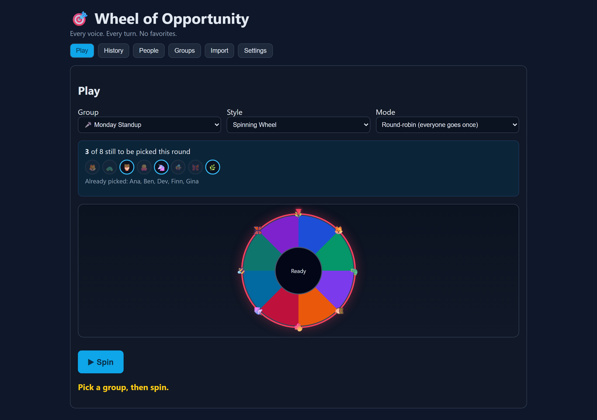
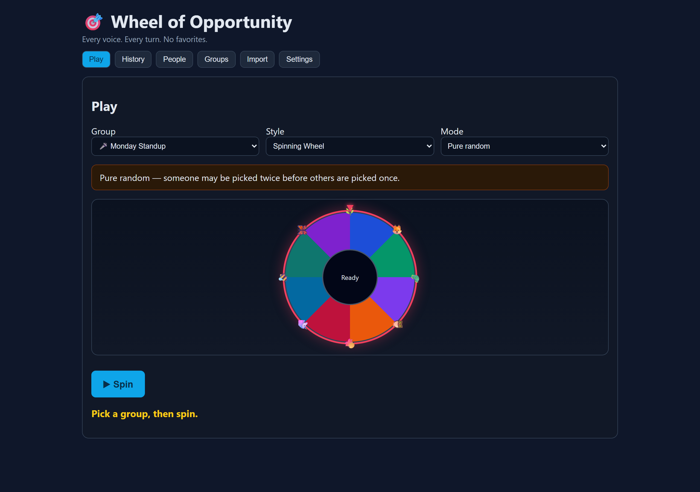
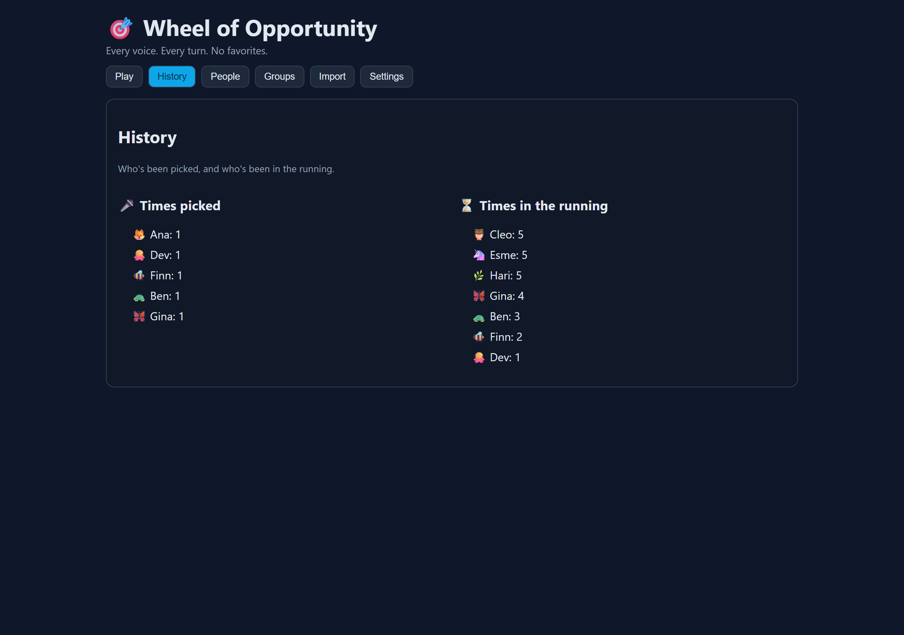
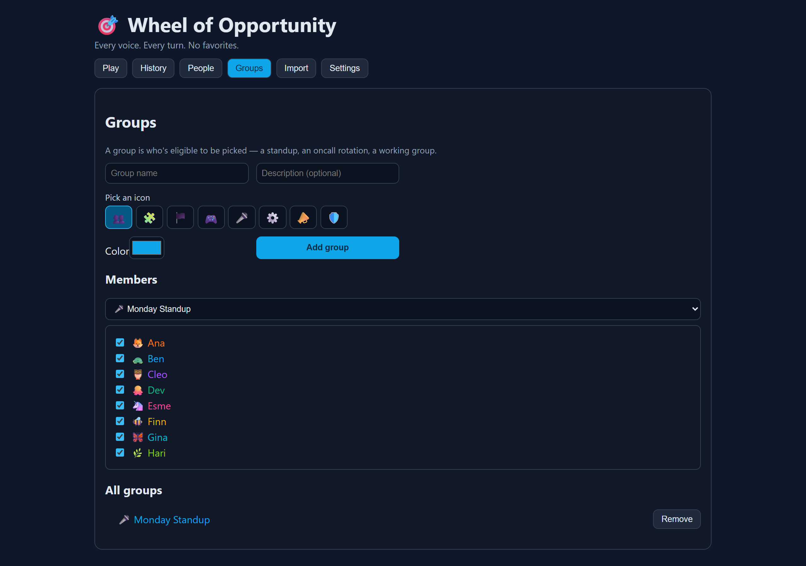
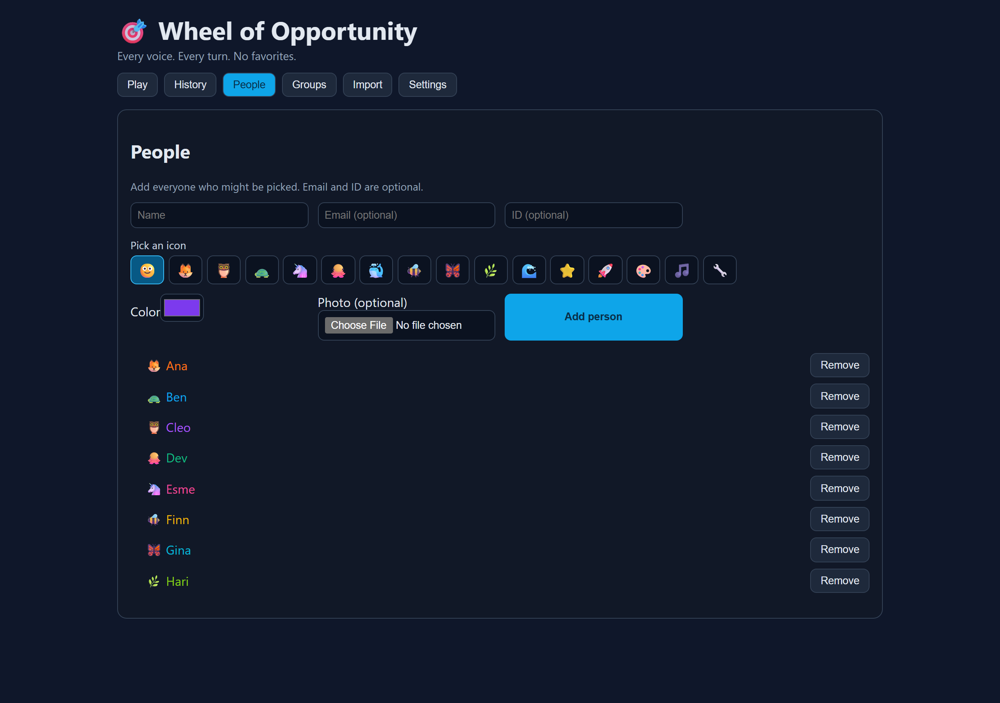

# Wheel of Opportunity

> **Every voice. Every turn. No favorites.**

A tiny browser app for groups that need to pick **who's up next** — the person who reports in standup, the engineer who takes the next oncall shift, the teammate who runs today's retro — without the loudest voice (or the manager's habits) deciding for them.

- **Live:** https://drlukeangel.github.io/WheelOfOpportunity/
- **Writeup:** https://lukeangel.co/blog/wheel-of-opportunity-fair-facilitation/
- Local-storage only, no accounts, no backend, free.

---

## The problem

In a group of 8 people, the same 2 talk in every meeting. The same 1 always volunteers for oncall. The same 3 always end up running the demo. It's not bad faith — it's that whoever-speaks-first wins, and a busy lead picks whoever's top-of-mind. Over weeks, the gap compounds: quiet people stay quiet, and the workload tilts.

The fix is not "let's all be more inclusive." The fix is to take the picking out of human hands for the picks that should rotate fairly.

## What this does

Pick a group. Spin the wheel. Someone's name comes up. That's it.

What's interesting is **how** it picks.



### Two modes — but one of them is the point

| Mode | What it does | When to use |
| --- | --- | --- |
| **Round-robin (depleting pool)** | Everyone gets picked once before anyone repeats. The pool refills only when it's empty. | The default for anything that matters. Standups, retros, oncall, demos. |
| **Pure random** | Each spin draws independently from the full group. Someone may get picked twice before someone else has gone once. | Trivia, party games, anything where streaks add to the fun. |

The fairness story is the **depleting pool**. The UI shows it on every spin:

- `5 of 8 still to be picked this round`
- A dot for every person — dim = already picked, lit = still queued
- A line listing exactly who's been picked so far

When the pool empties, the next spin starts a fresh round. No one is forgotten. No one repeats while someone else hasn't gone.

Switching to pure random surfaces a warning so people know what trade-off they're making:



## Other views

History keeps a running count of who's been picked and how many times each person has been *in the running*:



People and Groups are simple admin screens — add who, define which groups they belong to:





## Run it

```bash
git clone https://github.com/drlukeangel/WheelOfOpportunity.git
cd WheelOfOpportunity
npm install
npm run dev    # http://localhost:5173
```

All data lives in browser `localStorage`. There is no server, no account, no telemetry. Reset clears everything.

## Deploy

This repo deploys to GitHub Pages on every push to `main` via `.github/workflows/deploy.yml`. To deploy your own fork:

1. Enable Pages on the repo (Settings → Pages → Source: GitHub Actions)
2. Push to `main`
3. Update the `base` in `vite.config.ts` if your repo name is different

## Stack

`react` · `vite` · `typescript` · `localStorage`. ~40 modules, ~160 KB JS, ~5 KB CSS.

## License

MIT.

## Maintainer

[Luke Angel](https://lukeangel.co). Built for a friend who needed a way to pick speakers without picking favorites. Originally called *Wheel of Misfortune* — renamed once we noticed the joke was on the wrong side of the spin.
